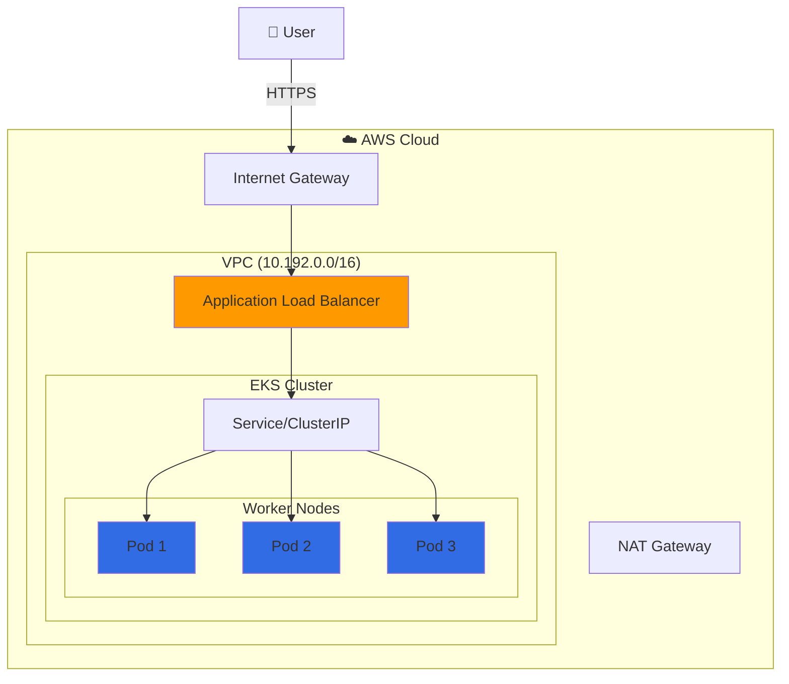
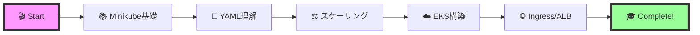

## 📖 Overview

このプロジェクトは、Kubernetesの基礎から本番環境まで段階的に学べるデモンストレーション環境です。
**Minikube**でローカル開発を始め、**AWS EKS**で本格的なクラウド環境を体験できます。

<table>
<tr>
<td width="50%">

### 🏠 Minikube (Local)
- 💻 **環境**: ローカルPC
- ⏱️ **セットアップ**: 5分
- 💰 **コスト**: 無料
- 🎯 **用途**: 学習・開発

</td>
<td width="50%">

### ☁️ AWS EKS (Cloud)
- 🌍 **環境**: AWS東京リージョン
- ⏱️ **セットアップ**: 30分
- 💰 **コスト**: $0.23/時間
- 🎯 **用途**: 本番想定・デモ

</td>
</tr>
</table>

## ✨ Features

<div align="center">
<table>
<tr>
<td align="center" width="33%">

<br>
<strong>簡単デプロイ</strong>
<br>
YAMLファイル一つで<br>アプリケーションを展開
</td>
<td align="center" width="33%">

<br>
<strong>負荷分散</strong>
<br>
Service & Ingressで<br>トラフィックを自動分散
</td>
<td align="center" width="33%">

<br>
<strong>スケーリング</strong>
<br>
ワンコマンドで<br>Pod数を調整
</td>
</tr>
</table>
</div>

## 📦 Quick Start

### 🔧 Prerequisites

<details>
<summary><b>必要なツールをインストール</b> 👈 クリックして展開</summary>

#### macOS
```bash
# Docker Desktop
brew install --cask docker

# Kubernetes tools
brew install kubectl minikube

# AWS tools (EKS用)
brew install awscli eksctl
```

#### Windows
- [Docker Desktop](https://www.docker.com/products/docker-desktop/)
- [Minikube](https://minikube.sigs.k8s.io/docs/start/)
- [kubectl](https://kubernetes.io/docs/tasks/tools/)

</details>

### 🚀 Minikube Demo (5分で体験)

```bash
# リポジトリをクローン
git clone https://github.com/yourusername/k8s-video-demo.git
cd k8s-video-demo

# Minikubeクイックスタート
minikube start --memory=2048 --cpus=2
kubectl apply -f minikube/
minikube service demo-service
```

👉 **[詳細な手順とトラブルシューティングはこちら](minikube/)**

### ☁️ AWS EKS Demo (本格環境)

```bash
# EKSクイックスタート（要AWS認証設定）
cd eks/01-preparation
eksctl create cluster -f cluster-config-with-vpc.yaml

cd ../02-demo-day
kubectl apply -f .
```

👉 **[詳細な構築手順とコスト管理はこちら](eks/)**

## 📚 Documentation

<table>
<tr>
<td width="50%">

### 📘 デモ環境

- 🏠 **[Minikube Demo](minikube/)**
  - ローカルKubernetes環境
  - 5分でセットアップ完了
  - 完全無料で学習可能

- ☁️ **[AWS EKS Demo](eks/)**
  - 本番想定のクラウド環境
  - ALBによる負荷分散
  - スケーラブルなアーキテクチャ

</td>
<td width="50%">

### 🛠️ 技術仕様

- **Kubernetes**: v1.30
- **Container Runtime**: Docker
- **Load Balancer**: AWS ALB (EKS)
- **Node Type**: t3.small (EKS)
- **Network**: VPC with NAT Gateway

</td>
</tr>
</table>

## 💡 Architecture for EKS



## 🗂️ Project Structure

```
k8s-video-demo/
├── 📂 minikube/           # ローカル環境
│   ├── deployment.yaml    # Nginxアプリ定義
│   ├── service.yaml       # NodePortサービス
│   └── README.md         # Minikubeガイド
│
├── 📂 eks/               # AWS環境
│   ├── 01-preparation/   # 事前準備
│   │   ├── infrastructure/
│   │   │   └── vpc-stack.yaml
│   │   └── cluster-config-with-vpc.yaml
│   │
│   ├── 02-demo-day/     # デモ本番
│   │   ├── configmap.yaml
│   │   ├── deployment.yaml
│   │   ├── service.yaml
│   │   └── ingress.yaml
│   │
│   └── README.md        # EKSガイド
│
└── 📄 CLAUDE.md         # AI向け仕様書
```

## 🎯 Learning Path

<div align="center">



</div>

## 🙏 Acknowledgments

- [Kubernetes Documentation](https://kubernetes.io/docs/)
- [AWS EKS Documentation](https://docs.aws.amazon.com/eks/)
- [Minikube Documentation](https://minikube.sigs.k8s.io/docs/)

---
